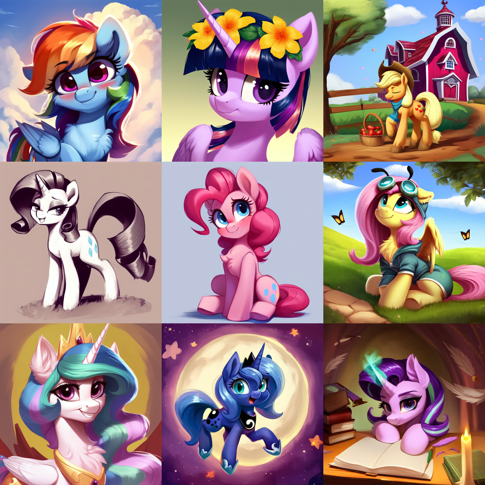
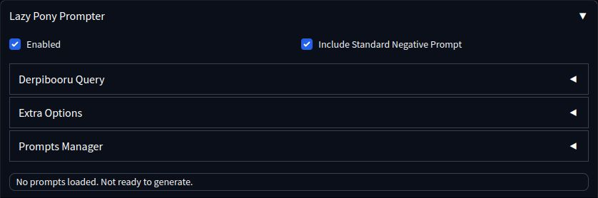
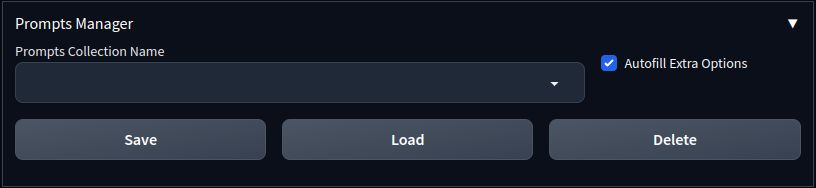

# Lazy Pony Prompter

A pony prompt helper extension for [AUTOMATIC1111's Stable Diffusion Web UI](https://github.com/AUTOMATIC1111/stable-diffusion-webui) and [ComfyUI](https://github.com/comfyanonymous/ComfyUI) that utilizes the full power of your favorite booru query syntax. Currently supports [Derpibooru](https://derpibooru/org) and [E621](https://e621.net).

E621 + [EasyFluff](https://civitai.com/models/129996/easyfluff) samples:


*\* images generated with EasyFluff V11.2 from query `my_little_pony solo -anthro -meme order:score -animated -text rating:safe -multiple_images`*

Derpibooru + [Pony Diffusion V5](https://civitai.com/models/95367/pony-diffusion-v5) samples:



*\* images generated with Pony Diffusion V5 from query `sweet dreams fuel, solo, safe, pony, -anthro`*

# Installation

### ❗Requirements
* [AUTOMATIC1111's Stable Diffusion Web UI](https://github.com/AUTOMATIC1111/stable-diffusion-webui) or [ComfyUI](https://github.com/comfyanonymous/ComfyUI);
* One of recommended models (may work on other, less pony-capable models, too):
  * [EasyFluff](https://civitai.com/models/129996/easyfluff);
  * [Pony Diffusion V5](https://civitai.com/models/95367/pony-diffusion-v5);
* Active internet connection for communication with boorus;
* *(optional)* [Derpibooru](https://derpibooru.org) account for extra functionality.

### 🖵  A1111 WebUI

Open the "Extensions" tab and then the "Install from URL" tab. Paste this repository link to the "URL" field:
```
https://github.com/Siberpone/lazy-pony-prompter
```

Click "Install" and after it's finished installing, restart the server. You should  now see the "Lazy Pony Prompter" fold on txt2img tab.

### 🛏 ComfyUI

Clone this repository to `.../ComfyUI/custom_nodes`

### 🙌 Manual
Clone this repository with:
```
git clone https://github.com/Siberpone/lazy-pony-prompter
```
Or click the "code" button in the top right, then click "Download ZIP". Unzip the downloaded archive anywhere on your file system. After that move the newly created repository folder to `.../stable-diffusion-webui/extentions` for A1111 WebUI or to `.../ComfyUI/custom_nodes` for ComfyUI.

# Usage
LPP operates by making a prompt list from a search query to one of the supported booru sites and then generating images using that list. Basically, it fetches tag data from a specified number of images in the query and converts it into "sensible" model-specific prompts (useless meta tags are pruned; "important" tags, like character name, are pushed closer to the beginning of the prompt, and so on...) and then randomly picks them to generate images.

## A1111 WebUI



At the very top you'll find the main controls for LPP: the`🗹 Enabled` checkbox, that controls whether LPP is active or not; the `Tag Source` dropdown, that selects one of the supported booru sites as the sorce for prompts and the `Prompts Format` dropdown that selects model-specific prompt formatting.

> **Warning**
>
> EasyFluff formatter includes artist names in the prompt. Lets just say there's some potential for drama here, so use with caution. Use "EasyFluff (no artist names)" instead if you don't want artist names included.

Below you'll find other LPP controls grouped into three foldable panels:

### 💬 Query

> **Note**
>
> Look of this panel may vary slightly, depending on the selected tag source.


On this panel you can pull tag data from selected booru site by typing in or pasting your query into the query textbox (the syntax is exactly the same as on the actual website). You can also set a number of additional options:

* **Number of prompts to load** - will attempt to fetch tag data from this number of images in the query;
* **Derpibooru specific:**
  * *Derpibooru Filter* - will apply this [Derpibooru filter](https://derpibooru.org/filters) to the query. Only system filters are available by default. If you want to use your personal filters, you must provide an [API key](#-api-key);
  * *Sort by* - type of sorting to apply to the query. Wilson Score is the default.
* **E621 specific:**
  * *Rating* - will append selected rating tag to the query.
  * *Sort by* - will append selected sorting type tag to the query.

Once you're happy with the settings, it's finally time to click the `Send` button. This will prompt LPP to send the search query to the site and generate prompts from the returned tag data. If all goes well, you'll see "Successfully fetched tags from *\<site\>*. *X* prompts loaded. Ready to generate." in the LPP status bar at the very bottom. This means that LPP is now ready to poni and all you have to do is tick the `☑ Enabled` checkbox at the very top and hit the `Generate` button.

### 🏷 Tags Filter

This panel allows you to filter out unwanted tags from generated prompts. Just type in a comma-separated list of tags you don't want to see in the generated prompts and they will be filtered out before image generation begins. Note, that simple [globbing](https://en.wikipedia.org/wiki/Glob_(programming)) is supported (i. e. you can use `*` to match anything, for example `*butt*` will filter out any tags containing word "butt"). The filter textbox is evaluated before every generation, so you can use it to tweak your currently loaded prompts collection.

### 💾 Prompts Manager



This panel is used to manage your prompt collections locally.

You can save your currently loaded prompts for future use by typing in the desired name in the `Prompts Collection Name` textbox and clicking the `Save` button.

You can load previously saved prompts by selecting the desired collection from `Prompts Collection Name` textbox (just start typing the name or select it from the dropdown hint) and clicking the `Load` button. If you have the `Autofill Tags Filter` checkbox ticked, it will also populate the `Tag Filter` textbox automatically if available (tag filter text is written to the prompts collection info when you save it).

To delete unwanted collection, select it from the `Prompts Collection Name` textbox and click the `Delete` button.

### ✨ Prompts Styling

LPP fully supports [A1111 styles feature](https://github.com/AUTOMATIC1111/stable-diffusion-webui/wiki/Features#styles). Any styles you select in the style box will be correctly applied to LPP-generated prompts. Furthermore, you can use the standard A1111 prompt textbox in the same way. By default, the prompt textbox content will be appended to LPP prompts, but you can alter that by including the special `{prompt}` token in a place where you want LPP-generated prompts to be pasted. Examples:

* *Place special Pony Diffusion V5 tags at the front:* `source_pony, score_9, {prompt}`;
* *Pad EasyFluff prompt with some quality tags:* `best quality, {prompt}, by ivan shishkin`.

#### EasyFluff Recommendations

EF works best with e621 as tags source, but will produce good results from Derpibooru tags as well.

#### Pony Diffusion V5 Recommendations

Derpibooru as tags source is highly recommended, however, e621 is also supported. It is also highly beneficial to, at least, include special model-specific `score_9` tag somewhere in the prompt. "Standard" negative prompt also improves generations quality: `lowres, bad anatomy, bad hands, text, error, missing fingers, extra digit, fewer digits, cropped, worst quality, low quality, jpeg artifacts, signature, watermark, username, blurry`.

## ComfyUI

> **Note**
>
> These are somewhat experimental and may have some bugs. Also, due to some ComfyUI interface limitations some UX compromises had to be made ;)

LPP nodes are available under `LPP` group. The interface and functionality are kept as closely as possible to A1111 extension. Drag this Princess Luna picture to your ComfyUI to load a demo with notes on every available node and a very basic workflow example:


## 🔑 API Key

To further personalize your queries you can provide LPP with your personal Derpibooru API key (requires Derpibooru account). This will enable LPP to use your personal [Derpibooru filters](https://derpibooru.org/filters) and access images from your watch list. To provide an API key, you must create a file named `derpi` (no extension) in the `.../stable-diffusion-webui/extentions/lazy-pony-prompter/auth` directory (create it if it doesn't exist) with a text editor of your choice and paste your personal API key into that file. The API key must be the first line in the file. You can obtain an API key from your Derpibooru account info page (hover over your user icon -> Account).

# Pro Tips & Potential Pitfalls
* 🐞 Found a bug? Create an [issue](https://github.com/Siberpone/lazy-pony-prompter/issues).
* 💬 Want to request a feature or have suggestions on how to improve the extension? Open up a [discussion](https://github.com/Siberpone/lazy-pony-prompter/discussions).
* You can see the latest additions to LPP in the [Changelog](CHANGELOG.md).
* You can use A1111's "Defaults" feature to customize LPP UI default values (Settings -> Defaults).
* LPP works best with images with high upvote/score count as those tend to be the most fully and properly tagged.
* LPP overrides webui prompts processing completely and, thus, not compatible with dynamic prompting extensions (you don't have to uninstall them or anything, just don't run them simultaneously with LPP).
* LPP is very light on traffic since it uses the website's API and only pulls necessary text data and not the actual webpages or images.
* Your saved prompts are stored in `tag_cache.dat` file in the root extension directory.
* Useful links:
    * [purplesmart.ai](https://purplesmart.ai) aka PSAI - V5 creators website with gallery and prompt examples.
    * [PSAI Discord server](http://discord.gg/94KqBcE) - poni AI discussion, help, tech support and free V5 bot.
    * [EasyFluff](https://civitai.com/models/129996/easyfluff)
    * [Stable Diffusion Guides Collection](https://rentry.org/sdgoldmine)
* 🐎 Please, poni responsibly 🐴🦄🪶.
