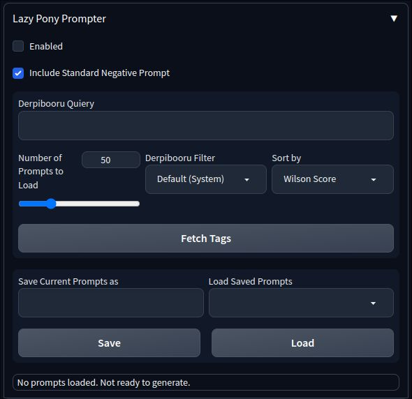

# Lazy Pony Prompter

A [Pony Diffusion V5](https://civitai.com/models/95367/pony-diffusion-v5) prompt helper extension for [AUTOMATIC1111's Stable Diffusion Web UI](https://github.com/AUTOMATIC1111/stable-diffusion-webui) that utilizes the full power of [Derpibooru](https://derpibooru.org) query syntax and filters.


*\* images generated on recommended V5 settings from query `sweet dreams fuel, solo, safe, pony, -anthro`*

# Installation

### ❗Requirements
* [AUTOMATIC1111's Stable Diffusion Web UI](https://github.com/AUTOMATIC1111/stable-diffusion-webui);
* [AstraliteHeart's Pony Diffusion V5](https://civitai.com/models/95367/pony-diffusion-v5) model;
* Active internet connection for communication with [Derpibooru](https://derpibooru.org);
* *(optional)* [Derpibooru](https://derpibooru.org) account.

### 🖵 From Web UI

Open the "Extensions" tab and then the "Install from URL" tab. Paste this repository link to the "URL" field:
```
https://github.com/Siberpone/lazy-pony-prompter
```

and click "Install". You should  now see the "Lazy Pony Prompter" fold on txt2img tab after webui server restart.

### 🙌 Manual
Clone this repository with
```
git clone https://github.com/Siberpone/lazy-pony-prompter
```
or click the "code" button in the top right, then click "Download ZIP" and unzip the downloaded archive. After that move the newly created repository folder to:
```
.../stable-diffusion-webui/extentions/
```

# Usage
LPP operates by making a prompt list from a [Derpibooru search query](https://derpibooru.org/pages/search_syntax) and then generating images using that list. Basically, it fetches tag data from a specified number of images in the query and converts it into "sensible" V5 prompts (character and important meta data tags are pushed closer to the beginning of the prompt; useless tags like `artist:*` or `dead source` are pruned; derpi rating is replaced with appropriate `rating_*` and so on...) and then randomly picks them to generate images. Now, lets take a look at the interface:



First thing you would do is type in or paste your query into the "Derpibooru Query" textbox (you can preliminarily tune your query on the actual website) using the [Derpibooru search syntax](https://derpibooru.org/pages/search_syntax). Then, below the textbox you can set a number of additional options:

* **Number of prompts to load** - will attempt to fetch tag data from this number of images in the query;
* **Derpibooru Filter** - will apply this [Derpibooru filter](https://derpibooru.org/filters) to the query. Only system filters are available by default. If you want to use your personal filters, you must provide an [API key](#-api-key);
* **Sort by** - type of sorting to apply to the query. Wilson Score is the default;
* **Prepend Prompts with** - this text will prepend all prompts;
* **Append to Prompts** - this text will be appended to all prompts;
* **Prune These Tags from Prompts** - you can specify additional tags to prune from prompts here (comma separated). *Note:* this doesn't affect the actual query.

Once you're happy with the settings, it's finally time to click the `Fetch Tags` button. This will prompt LPP to send the search query to Derpibooru and generate prompts from the returned tag data. If all goes well, you'll see "Successfully fetched tags from Derpibooru. **X** prompts loaded. Ready to generate." in the LPP status bar at the very bottom. This means that LPP is now ready to poni and all you have to do is tick the `☑ Enabled` checkbox at the very top and hit the `Generate` button.

### 🚫 Negative Prompt Handling

LPP includes "standard" V5 negative prompt by default. This can be disabled by unticking the "Include Standard Negative Prompt" checkbox. The "standard" negative prompt is appended to whatever you type in the normal webui negative prompt textbox.

### 💾 Saving and Loading Prompts

You can save your currently loaded prompts for future use by typing in the desired name in the "Save Current Prompts As" textbox and clicking the `Save` button underneath. You can load previously saved prompts by selecting the desired collection from the "Load Saved Prompts" dropdown and clicking the `Load` button underneath. Success or failure of these operations will be reported in the status bar at the very bottom of the LPP interface.

### 🔑 API Key

To further personalize your queries you can provide LPP with your personal Derpibooru API key (requires Derpibooru account). This will enable LPP to use your personal [Derpibooru filters](https://derpibooru.org/filters) and access images from your watch list. To provide the API key, you must create the `api_key` file in the root LPP extension directory (normally this would be `.../stable-diffusion-webui/extentions/lazy-pony-prompter`) with a text editor of your choice and paste your personal API key into that file. The API key must be the first line in the file. You can obtain an API key from your Derpibooru account info page (hover over your user icon -> Account).

### ✅ Pro Tips & Potential Pitfalls
* 🐞 Found a bug? Create an [issue](https://github.com/Siberpone/lazy-pony-prompter/issues).
* 💬 Want to request a feature or have suggestions on how to improve the extension? Open up a [discussion](https://github.com/Siberpone/ponyverse/discussions).
* LPP works best with images with high upvote/score count as those tend to be the most fully and properly tagged.
* LPP overrides webui prompts processing completely and, thus, not compatible with dynamic prompting extensions.
* LPP is very light on traffic since it uses the Derpibooru API and only pulls necessary text data and not the actual webpages or images.
* Useful links:
    * [purplesmart.ai](https://purplesmart.ai) aka PSAI - V5 creators website with gallery and prompt examples.
    * [PSAI Discord server](http://discord.gg/94KqBcE) - poni AI discussion, help, tech support and free V5 bot.
    * [Stable Diffusion Guides Collection](https://rentry.org/sdgoldmine)
* 🐎 Please, poni responsibly 🐴.
